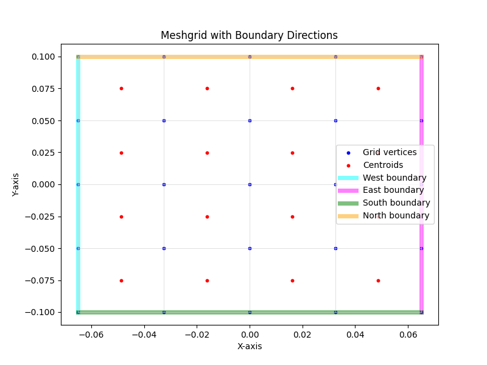
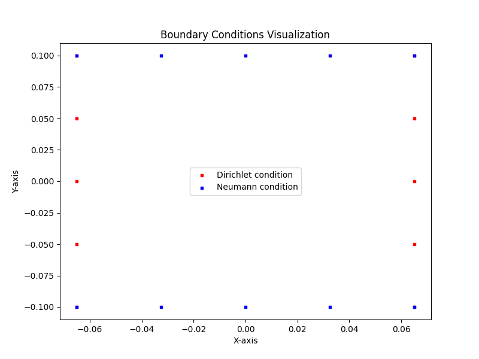
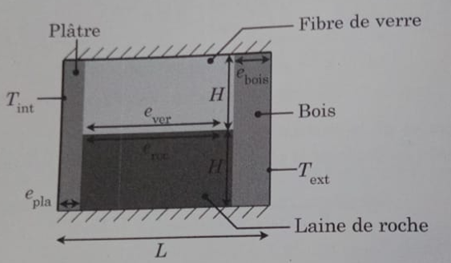

Technical Report: Python Package for 2D Diffusion Simulation 1
==============================================================
.. highlights:: 
  * - El Hadji Mama GUENE  elhadjmama.guene@gmail.com
  * - Makha NDAO2          makha.ndao@uam.edu.sn

.. list-table::
   :widths: 10 
   :header-rows: 1

   * - SolayMath, mathematical sciences and AI development, Rennes, France 3
   * - Département sciences de la matière et de l’univers, UFR sciences et technologies avancées
   * - Université Amadou Mahtar Mbow, BP : 45927, Diamniadio, Sénégal 5
   * - Laboratoire de Photonique Quantique, d’Energie et de Nano-Fabrication, Faculté des Sciences et Techniques, 6
   * - Université Cheikh Anta Diop de Dakar (UCAD), B.P. 5005 Dakar-Fann, Dakar, Senegal 7

.. contents::

Introduction
============

This report describes the development of a Python package designed for
the numerical simulation of the two-dimensional diffusion equation. The
package provides a framework for solving 2D partial differential
equations (PDEs) using finite difference methods. Key features include
domain discretization, boundary condition management, matrix assembly,
and solver integration.

Overview
========

The Python package was developed to simulate the diffusion process
governed by the following PDE:

.. math:: \rho Cp\frac{\partial T}{\partial t} = \nabla \cdot (\kappa \nabla T) + S

where:

-  :math:`T(x, y, t)`: Temperature field,

-  :math:`\rho(x, y)`: Material density,

-  :math:`C_p(x, y)`: Heat capacity,

-  :math:`\kappa(x, y)`: Thermal conductivity,

-  :math:`S(T, x, y)`: Source term.

The package employs the finite difference method to discretize the
equation, followed by matrix assembly and solving the resulting linear
system.

Structure of the Package
========================

The package was designed with modularity in mind, following principles
of object-oriented programming. The core components of the package are
as follows:

-  **Domain Class**: Handles domain creation and mesh generation.

-  **Physical parameters Class**: Stores and validates physical
   parameters such as thermal conductivity, heat capacity, and density.

-  **BoundaryConditions Class**: Manages Dirichlet and Neumann boundary
   conditions.

-  **SystemMatrix Class**: Constructs the matrix and right-hand side
   (RHS) for the linear system.

-  **Solver Class**: Solves the linear system iteratively.

Domain class
============

Domain Discretization
---------------------

The domain is discretized into a structured grid of cells. Each cell is
labeled, and vertices are assigned unique identifiers. The mesh
generation process ensures the grid’s compatibility with finite
difference schemes.

The ``Domain`` class is responsible for creating and managing the
computational domain. It provides methods for mesh generation, boundary
detection, and visualization. The class contains the following elements:

Constructor
-----------

The constructor initializes the domain dimensions:

-  ``Lx (float)``: Length of the domain in the x-direction.

-  ``Ly (float)``: Length of the domain in the y-direction.

To initialize the domain we can define:

::

   domain = Domain(Lx, Ly)

Functions
---------

``create_mesh(nx, ny)``
~~~~~~~~~~~~~~~~~~~~~~~

This function generates the computational mesh for the domain. The
vertices and centroids are created based on the number of grid points
(``nx, ny``) in the x- and y-directions. The function returns 4 elements
such as:

-  ``centroid_position``: Coordinates of cell centroids.

-  ``vertices_position``: Coordinates of the grid vertices.

-  ``centroid_number``: Indexing for centroids.

-  ``contour_indices``: Indices of boundary vertices.

using this following code:

::

   domain.create_mesh(nx, ny)

``visualize_meshgrid(centroid_position, vertices_position, title)``
~~~~~~~~~~~~~~~~~~~~~~~~~~~~~~~~~~~~~~~~~~~~~~~~~~~~~~~~~~~~~~~~~~~

This function visualizes the meshgrid of the domain. It highlights:

-  Centroid points (red).

-  Grid points (blue).

The user can specify the title of the plot.

::

   domain.visualize_meshgrid(centroid_podition, vertices_position, your_title)

``get_boundary_indices()``
~~~~~~~~~~~~~~~~~~~~~~~~~~

This function identifies and retrieves the vertex indices corresponding
to the domain boundaries. Vertices are categorized into:

-  ``west (x = xmin)``,

-  ``east (x = xmax)``,

-  ``north (y = ymax)``,

-  ``south (y = ymin)``.

To ensure no duplicates, overlapping vertices (e.g., corners) are
assigned to only one boundary.

``set_mixed_boundary_conditions(side, dirichlet_mask, neumann_mask, vertices_position)``
~~~~~~~~~~~~~~~~~~~~~~~~~~~~~~~~~~~~~~~~~~~~~~~~~~~~~~~~~~~~~~~~~~~~~~~~~~~~~~~~~~~~~~~~

This function allows the user to set mixed boundary conditions
(Dirichlet and Neumann) on a specific side of the domain:

-  ``side (str)``: One of ``"west", "east", "north", "south"``.

-  ``dirichlet_mask``: A filter function to select Dirichlet vertices.

-  ``neumann_mask``: A filter function to select Neumann vertices.

-  ``vertices_position``: Meshgrid vertex positions.

::

   domain.set_mixed_boundary_conditions(dirichlet_mask, neumann_mask, vertices_position)

| At this stage, the user must create the masks for "west", "east",
  "south", and "north" for the boundary conditions.
| Here’s an example function to create the masks for the "west", "east",
  "south," and "north" boundary conditions:

::

   def boundaries_choice_and_viz(vertex_pos, domain):
       # dirichlet condition on the west side
       dirichlet_mask_west = lambda X, Y: (X == -Lx / 2) & (-Ly / 2 <= Y <= Ly / 2)  
       neumann_mask_west = lambda X, Y: None
       domain.set_boundary_conditions("west", dirichlet_mask_west, neumann_mask_west, vertex_pos)
       # dirichlet condition on the east side
       dirichlet_mask_east = lambda X, Y: (X == Lx / 2) & (-Ly / 2 <= Y <= Ly / 2)  
       neumann_mask_east = lambda X, Y: None  
       domain.set_boundary_conditions("east", dirichlet_mask_east, neumann_mask_east, vertex_pos)
       # neumann condition on the north side
       dirichlet_mask_north = lambda X, Y: None  
       neumann_mask_north = lambda X, Y: (Y == Ly / 2) & (-Lx / 2 <= X <= Lx / 2)  
       domain.set_boundary_conditions("north", dirichlet_mask_north, neumann_mask_north, vertex_pos)
       # neumann condition on the south side
       dirichlet_mask_south = lambda X, Y: None  
       neumann_mask_south = lambda X, Y: (Y == -Ly / 2) & (-Lx / 2 <= X <= Lx / 2) 
       domain.set_boundary_conditions("south", dirichlet_mask_south, neumann_mask_south, vertex_pos)

You can use the provided function as a starting point for creating and
testing simple boundary masks. Once you’re comfortable, you can expand
the logic to include mixed boundary conditions by introducing masks that
differentiate between Dirichlet and Neumann conditions on the same
boundary. This function is then called within the routine.

::

   boundaries_choice_and_viz(vertex_pos, domain)

``visualize_boundary_conditions(vertices_position)``
~~~~~~~~~~~~~~~~~~~~~~~~~~~~~~~~~~~~~~~~~~~~~~~~~~~~

This function visualizes the boundary conditions applied to the domain.
It annotates each side of the domain. Dirichlet vertices are highlighted
in red, while Neumann vertices are highlighted in blue.

::

   domain.visualize_boundary_conditions(vertex_pos)

Recap
-----

To define the domain and prepare it for finite difference analysis, as a
user, you only need to write 4 lines of code. Here’s an example to get
started with the package. Suppose you are creating a main.py file to
start coding. The first step is to import the Domain class, add the
domain size and the numerical data.

::

   from domain import Domain
   Lx = 1
   Ly = 1
   nx = 51
   ny = 51
   # Define the domain
   domain = Domain(Lx, Ly)
   # Mesh the domain 
   centroid_position, vertices_position, centroid_number, contour_indices = domain.create_mesh(nx, ny)
   # visualize the meshed domain
   domain.visualize_meshgrid(centroid_podition, vertices_position, your_title)
   # create mask and set the boundary condition
   boundaries_choice_and_viz(vertex_pos, domain)
   # Visualize the all the boundary vertices
   domain.visualize_boundary_conditions(vertex_pos)

   name: staggered_mesh_grid

   domain visualization for nx=ny=5. We can identify vertices, centroid
   and the boundaries limits.

   name: staggered_grid

   We select vertices with Neuman or Dirichlet condition.

Implementation Details
======================

Boundary Conditions
-------------------

Boundary conditions are categorized as Dirichlet (fixed values) or
Neumann (flux conditions). Customizable functions allow for spatially
varying boundary values. The boundary matrices :math:`b` (Dirichlet) and
:math:`c` (Neumann) are constructed for each side (west, east, north,
south). The BoundaryConditions class is a crucial component of the
diffusion simulation package, responsible for defining and managing the
boundary conditions applied to the domain. It supports both Dirichlet
(fixed value) and Neumann (flux) boundary conditions, with the
flexibility to handle mixed conditions on the same side of the domain.
This class provides methods to initialize, customize, and visualize
boundary conditions effectively.

-  **Initialization**: The constructor initializes the
   BoundaryConditions class with the following parameters:

   #. nx, ny: number of grid points in the x- and y-directions

   #. domain: an instance of the Domain class, which contains
      information about the mesh and boundaries

   #. g: Represents Neumann boundary conditions (flux). It can be a
      constant value or a user-defined function.

   #. TBC: Represents Dirichlet boundary conditions (temperature on the
      boundary). It can also be constant or spatially varying, depending
      on the user’s requirements.

   These inputs allow the class to define and store matrices that
   describe boundary conditions for all sides of the domain.

-  **Boundary Matrix Creation:** The method create_boundary_matrices is
   used to construct matrices that represent the boundary conditions for
   a specific side of the domain (west, east, north, south). It:

   #. Determines Boundary Types: Separates Dirichlet and Neumann
      conditions based on predefined criteria (e.g., user-specified
      vertex indices).

   #. Constructs Matrices:

      -  Dirichlet Boundary Matrix (b): Represents locations where
         Dirichlet conditions are applied. For example, entries are set
         to 1 where Dirichlet conditions are active and 0 elsewhere.

      -  Neumann Boundary Matrix (c): Represents locations where Neumann
         conditions are applied, with entries corresponding to the flux
         values.

   By generating these matrices, the method ensures that boundary
   conditions are integrated seamlessly into the finite difference
   scheme.

-  **Customization of Boundary Conditions**: The
   customize_boundary_conditions_from_vertices method provides the
   flexibility to define complex, mixed boundary conditions using vertex
   indices. The process is as follows:

   #. Input Vertex Information:

      -  Dirichlet Indices: Specify the vertices where Dirichlet
         conditions are active.

      -  Neumann Indices: Specify the vertices where Neumann conditions
         are active.

   #. Midpoint Calculation:

      -  The compute_midpoint_value helper function calculates property
         values (e.g., flux or temperature) at the midpoints between
         adjacent vertices.

      -  This ensures accurate representation of spatially varying
         conditions for both Dirichlet and Neumann boundaries.

   #. Assign Conditions:

      -  Dirichlet and Neumann conditions are assigned to the respective
         boundaries using the calculated midpoint values.

      -  For example, a single side of the domain (e.g., west) can have
         Dirichlet conditions on part of the boundary and Neumann
         conditions on the rest.

   This method allows users to apply boundary conditions that vary
   spatially or combine multiple types on the same side.

-  | **Computation of Midpoint Values**
   | The compute_midpoint_value function is a utility method that
     calculates values at the midpoints of adjacent vertices. This is
     especially useful for Neumann boundary conditions, where the flux
     depends on gradients calculated at these midpoints.

   Steps:

   #. Input: Vertex indices along a boundary and a user-defined function
      (e.g., for g(x,y)).

   #. Midpoint Calculation:

      -  For each pair of adjacent vertices, their coordinates are
         averaged to compute the midpoint.

      -  The user-defined function is evaluated at the midpoint to
         determine the corresponding property value.

   #. Output: A list of midpoint values that are subsequently assigned
      to the boundary matrices.

   This function ensures that both Dirichlet and Neumann conditions are
   implemented with high accuracy.

Recap: BoundaryConditions Class
-------------------------------

The BoundaryConditions class manages the definition and customization of
boundary conditions for the domain. It supports Dirichlet (fixed value),
Neumann (flux), and mixed conditions, allowing flexibility for complex
boundary setups.

::

   from domain import Domain
   from boundary_conditions import BoundaryConditions

   Lx = 1
   Ly = 1
   nx = 51
   ny = 51
   # Define the domain
   domain = Domain(Lx, Ly)
   # Mesh the domain 
   centroid_pos, vertices_pos, centroid_number, contour_indices = domain.create_mesh(nx, ny)
   # visualize the meshed domain
   domain.visualize_meshgrid(centroid_pos, vertices_pos, your_title)
   # create mask and set the boundary condition
   boundaries_choice_and_viz(vertex_pos, domain)
   # Visualize the all the boundary vertices
   domain.visualize_boundary_conditions(vertex_pos)

   # BOUNDARY MATRIX DESIGN
       boundary = BoundaryConditions(nx, ny, domain)
       bW, cW = boundary.bW, boundary.cW
       bE, cE = boundary.bE, boundary.cE
       bS, cS = boundary.bS, boundary.cS
       bN, cN = boundary.bN, boundary.cN

       g_func = lambda x, y: 0  # Example Neumann flux
       tbc_func = lambda x, y: 20 + 273 if x == -Lx / 2 else -10 + 273  if x == Lx / 2 else 0
   boundary.customize_boundary_conditions_from_vertices(domain,vertex_pos, g_func, tbc_func)
   # compute the wall flow g and the wall temperature TBC
   g = boundary.g
   TBC = boundary.TBC

Matrix Assembly
---------------

| The SystemMatrix class is responsible for constructing and solving the
  linear system arising from the discretization of the 2D diffusion
  equation. Automates the computation of the system matrix, the
  right-hand side (RHS), and the temperature solution, using the
  coefficients that come from the derivation of the residual form of the
  PDE and the user-defined parameters.
| The constructor is a placeholder and does not perform any
  initialization tasks. It serves as a structural foundation for the
  class. We use the following module in this class:

#. **generate_coefficients(self, source_term=None)**: Computes the
   coefficients and the RHS of the diffusion equation theoretically
   using the residual form of the PDE. The argument source_term is a
   callable or constant representing the source term in the equation. It
   can depend on the space and the internal or external domain
   temperature. Acts as the core of the theoretical formulation,
   bridging mathematical derivations with computational implementation.

#. **interior_contribution_matrix(self, ncx, ncy)**: Constructs the
   interior contribution matrices that represent the interaction between
   neighboring cells. These matrices are essential for building the
   matrix of the system, as they encode the relationships between a cell
   and its neighbors in the discretized domain. Ouput:
   :math:`a_W, a_E, a_S, a_N` interior contribution matrices for the
   neighbors in the west, east, south and north.

#. **build_matrix(self, ncx, ncy, dx, dy, dt, density, heat_capacity,
   thermal_conductivity, aW, bW, cW, aE, bE, cE, aS, bS, cS, aN, bN, cN,
   Toc, TBC, g)**: We Construct here the full system matrix and RHS for
   the linear system based on boundary conditions and physical
   parameters. It is a combination of the interior and boundary
   contributions into a single system that represents the discretized
   diffusion equation.

#. **solve_system(self, TM, rhs)** solves the linear system using the
   equation

   .. math:: M.T= RHS

   \ to calculate the temperature distribution for each iteration. Be
   careful, don’t forget to update all the variables that depend on the
   temperature. We can visualize the temperature values computed for the
   domain. This module provides the final solution for the temperature
   field, completing the diffusion simulation.

Application: Heat Transfer in a Composite Wall
==============================================

   name: composite Wall

| A composite wall of a house, shown in Figure `3 <#composite>`__, one
  meter deep, consists of a layer of plaster with a thickness of
  e\ :math:`_{pla}` = 10 mm and a thermal conductivity k\ :math:`_{pla}`
  = 0.17 W/m\ :math:`\cdotp` K, a layer of fiberglass with a thickness
  of e\ :math:`_{ver}` = 100 mm and a thermal conductivity
  k\ :math:`_{ver}` = 0.039 W/m :math:`\cdotp` K, a layer of rock wool
  with a thickness of e\ :math:`_{roc}` = 20 mm and a thermal
  conductivity k\ :math:`_{roc}` = 0.042 W/m :math:`\cdotp` K and
  finally, a layer of wood with a thickness of e\ :math:`_{bois}`\ = 20
  mm, and a thermal conductivity k\ :math:`_{bois}`\ = 0.12 W/m
  :math:`\cdotp` K.
| The temperature at the interior surface of the wall is
  T\ :math:`_{\text{int}} = 20 \, ^{\circ}\text{C}`, and the temperature
  at the exterior surface is
  T\ :math:`_{\text{ext}} = -15 \, ^{\circ}\text{C}`. Heat transfer is
  assumed to be unidirectional along the x-axis, and the lateral
  surfaces are insulated.

::

   import numpy as np
   import matplotlib.pyplot as plt
   from domain import Domain
   from boundary_conditions import BoundaryConditions
   from system_matrix import SystemMatrix

   def boundaries_choice_and_viz(vertex_pos, domain):
       # west
       dirichlet_mask_west = lambda X, Y: (X == -Lx / 2) & (-Ly / 2 <= Y <= Ly / 2)  #
       neumann_mask_west = lambda X, Y: None
       domain.set_boundary_conditions("west", dirichlet_mask_west, neumann_mask_west, vertex_pos)
       # east
       dirichlet_mask_east = lambda X, Y: (X == Lx / 2) & (-Ly / 2 <= Y <= Ly / 2)  #
       neumann_mask_east = lambda X, Y: None  #
       domain.set_boundary_conditions("east", dirichlet_mask_east, neumann_mask_east, vertex_pos)
       # north
       dirichlet_mask_north = lambda X, Y: None  #
       neumann_mask_north = lambda X, Y: (Y == Ly / 2) & (-Lx / 2 <= X <= Lx / 2)  #
       domain.set_boundary_conditions("north", dirichlet_mask_north, neumann_mask_north, vertex_pos)
       # south
       dirichlet_mask_south = lambda X, Y: None  #
       neumann_mask_south = lambda X, Y: (Y == -Ly / 2) & (-Lx / 2 <= X <= Lx / 2)  #
       domain.set_boundary_conditions("south", dirichlet_mask_south, neumann_mask_south, vertex_pos)
       print(".......... Visualize the different types of boundary conditions ...........")
       domain.visualize_boundary_conditions(vertex_pos)

   def material(prop_roc, prop_pla, prop_bois, prop_ver):
       custom_function = prop_roc * np.ones(Xc.shape)
       custom_function[0: int(e_pla / dx), :] = prop_pla
       custom_function[int((Lx - e_bois) / dx):ncx, :] = prop_bois
       custom_function[int(e_pla / dx): int((e_pla + e_roc) / dx), int(h_roc / dy):] = prop_ver
       return custom_function

   def deg2kelvin(T):
       return T + 273.15

   def kelvin2degree(T):
       return T - 273.15

   if __name__ == '__main__':
       print("... MATERIALS..." * 3)
       # plaster
       k_pla = 0.17 #W/m.K
       e_pla = 10e-3 #m
       Cp_pla = 1000
       density_pla = 800
       # rock
       k_roc = 0.042
       e_roc = 100e-3
       h_roc = 1
       Cp_roc = 800
       density_roc = 2500
       # wood
       k_bois = 0.12
       e_bois = 20e-3
       Cp_bois = 1200
       density_bois = 500
       # fiberglass
       k_ver = 0.039
       e_ver = 100e-3
       h_ver = 1
       Cp_ver = 800
       density_ver = 10
       print("...CREATE DOMAIN..." * 5)
       Lx = e_pla + e_roc + e_bois
       Ly = (h_roc + h_ver)*0.1
       nx = 5
       ny = int(Ly/Lx)*nx
       print(ny)
       ncx = nx - 1
       ncy = ny - 1
       dx = Lx / ncx
       dy = Ly / ncy

       domain = Domain(Lx, Ly)
       print(f"............. Generate the mesh with {nx}x{ny} grid points ...........")
       centroid_pos, vertex_pos, centroid_num, contour_indices = domain.create_mesh(nx, ny)
       print("............ Visualize the mesh with boundary directions ..........")
       domain.visualize_meshgrid(centroid_pos, vertex_pos, title="Meshgrid with Boundary Directions")
       boundaries_choice_and_viz(vertex_pos, domain)
       centroid_position, vertices_position, centroid_number, contour_indices = domain.create_mesh(nx,ny)
       Xc, Yc = centroid_position
       density = material(density_roc, density_pla, density_bois, density_ver)
       heat_capacity = material(Cp_roc, Cp_pla, Cp_bois, Cp_ver)
       conductivity = material(k_roc, k_pla, k_bois, k_ver)

       colorinterpolation = 100
       colourMap = plt.cm.jet
       plt.contourf(Xc, Yc, conductivity, colorinterpolation, cmap=colourMap)
       plt.xlabel('Xc')
       plt.ylabel('Yc')
       plt.title("Mask")
       cbar = plt.colorbar()
       ticks = cbar.get_ticks()
       cbar.set_ticks(ticks)
       cbar.set_ticklabels([int(t) for t in ticks])
       plt.axis('equal')
       plt.show()

       print("...BOUNDARY MATRIX DESIGN..." * 4)
       boundary = BoundaryConditions(nx, ny, domain)

       bW, cW = boundary.bW, boundary.cW
       bE, cE = boundary.bE, boundary.cE
       bS, cS = boundary.bS, boundary.cS
       bN, cN = boundary.bN, boundary.cN

       T_int = 20
       T_ext = 20

       g_func = lambda x, y: 0  # Example Neumann flux
       tbc_func = lambda x, y: deg2kelvin(T_int) if x == -Lx / 2 else deg2kelvin(T_ext) if x == Lx / 2 else 0
       boundary.customize_boundary_conditions_from_vertices(domain=domain, vertices_position=vertex_pos, g_func=g_func,
                                                            tbc_func=tbc_func)
       g = boundary.g
       TBC = boundary.TBC
       TBC[0, 0] = 20 + 273.15
       TBC[0, ncy-1] = 20 + 273.15
       TBC[ncx-1, 0] = 20 + 273.15
       TBC[ncx-1, ncy-1] = 20 + 273.15

       print(g)
       print(TBC)
       print("... SOLVING EQUATION SYSTEM ..." * 4)

       def custom_source(Toc, x, y):
           return 0

       source_term = custom_source
       matrix_rhs = SystemMatrix()

       # generate interior matrix
       aW, aE, aS, aN = matrix_rhs.interior_contribution_matrix(ncx, ncy)

       coefficients, rhs = matrix_rhs.generate_coefficients(source_term)

       dt = 60
       # temperature Toc
       Toc = np.zeros((ncx, ncy))
       Toc = deg2kelvin(Toc)
       time = 0

       for nt in range(1):
           # Solving the equation system
           time = time + dt
           TM, rhs = matrix_rhs.build_matrix(ncx, ncy, dx, dy, dt, density, heat_capacity, conductivity,
                                             aW, bW, cW, aE, bE, cE, aS, bS, cS, aN, bN, cN, Toc, TBC, g)
           Tc = matrix_rhs.solve_system(TM, rhs)
           Tc = Tc.reshape((ncx, ncy))
           # update temperature
           Toc = Tc.reshape((ncx, ncy))
           # visualisation Temperature
           colorinterpolation = 100
           colourMap = plt.cm.jet  # you can try: colourMap = plt.cm.coolwarm
           fig = plt.figure()
           plt.title("Temperature au temps = %2.1f s" % time)
           plt.contourf(Xc, Yc, kelvin2degree(Tc), colorinterpolation, cmap=colourMap)
           #plt.axis("equal")
           plt.colorbar()
           plt.show()

Conclusion
==========

The developed Python package provides a robust and modular framework for
2D diffusion simulations. It offers flexibility in domain setup,
boundary condition customization, and numerical solver integration,
making it suitable for a variety of applications.

Future Work
===========

Future developments may include:

-  Extending the package to 3D diffusion simulations.

-  Integrating advanced solvers for non-linear PDEs.
